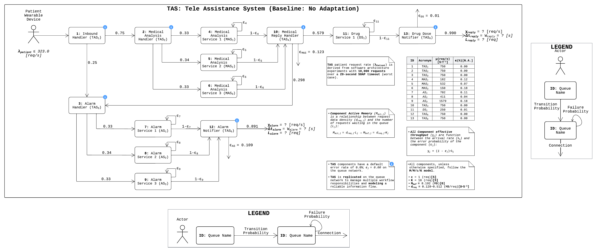
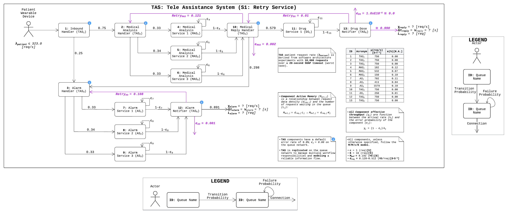
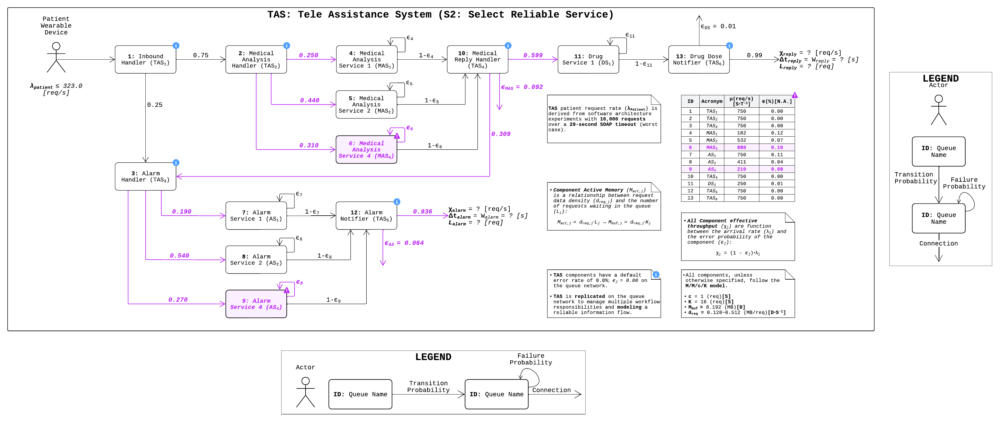
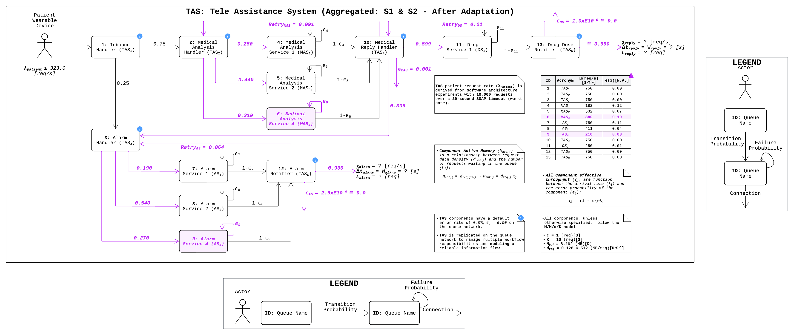
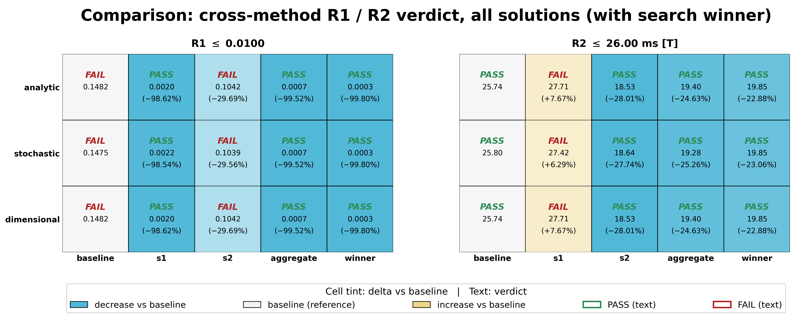
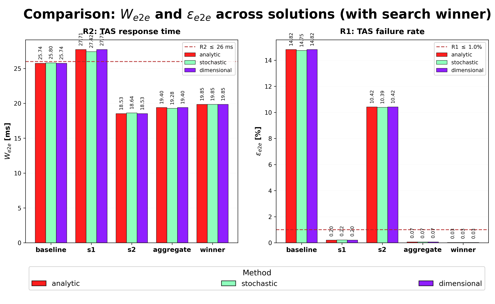
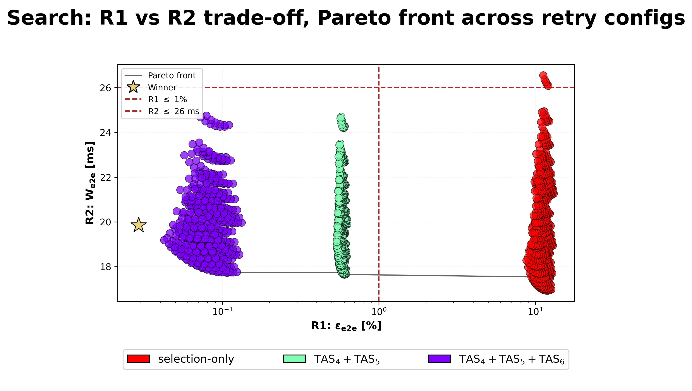
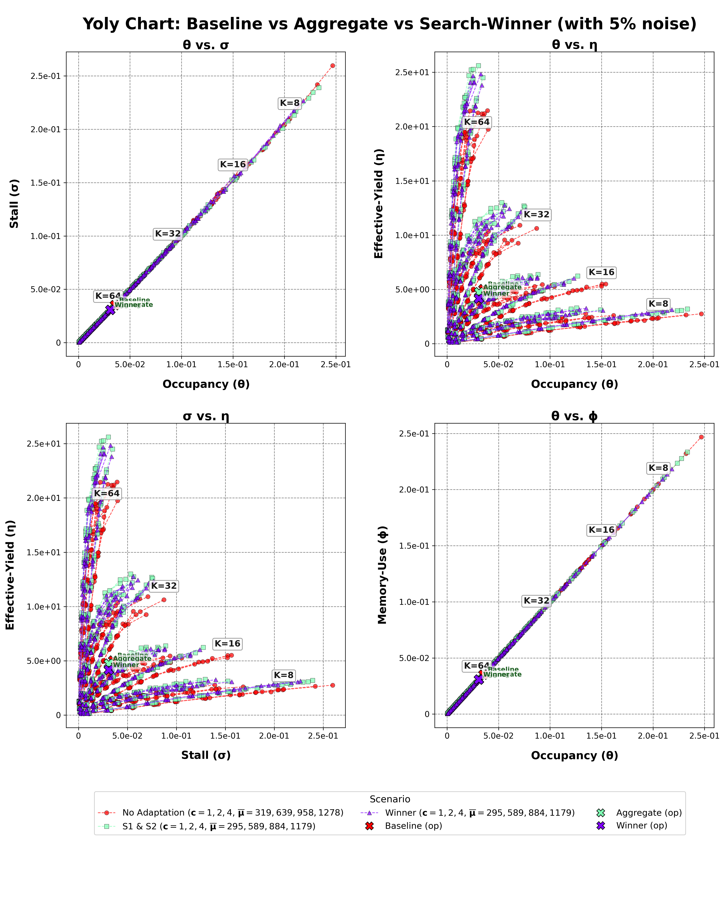
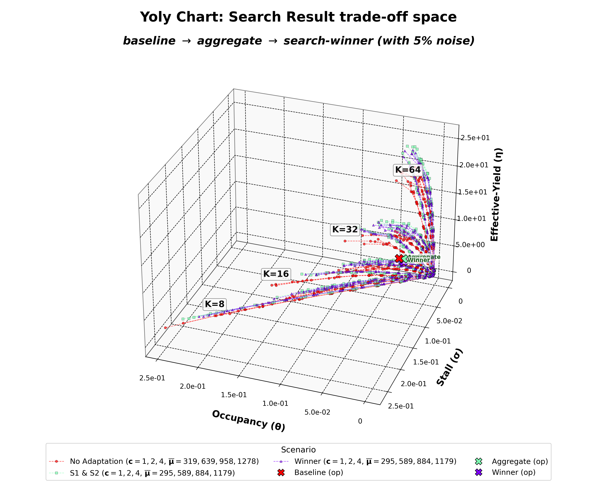

# CS-1 TAS: DASA Evaluation Report

This is the DASA (Dimensional Analysis for Software Architecture) evaluation of the Tele Assistance System (TAS). It records how TAS was modelled dimensionally, what the runs found across four self-adaptation strategies plus a constructive search, and what the results mean for the two quality-attribute requirements under test (Availability and Performance). The modelling derivation and the cross-validated results live together here, mirroring the dissertation's evaluation chapter. For the architecture itself (what TAS is, its workflow, its service catalogue) see [case-study.md](case-study.md); for the experimental method and the six-notebook pipeline that produced these numbers see [procedure.md](procedure.md).

The locked operating envelope for every number below is `lambda_z = 323` req/s, `K = 16`, `c = 1`, with dimensional bounds `sigma_R2 ~ 0.525` and `eta_R1 ~ 34.80`.

---

## 1. Executive summary

CS-1 models TAS as a 14-node loss-network queue (13 service stations plus one absorbing `FAIL_{1}` sink) and decides two quality-attribute requirements across four adaptations, then asks a constructive design question. Three independent predictive pipelines (analytic closed-form, stochastic SimPy discrete-event simulation, dimensional Pi-group bounds) compute the same verdicts, and a DASA-coefficient-guided search constructs a configuration that beats the best hand-authored design, cross-validated by an off-the-shelf optimiser.

The result is a clean performance-versus-availability trade-off. Retry buys availability at a performance cost, the reliable-service swap buys performance but not enough availability, and only the combination of the two clears both bounds.

| Solution | Failure rate (`eps_e2e`) | R1 (<= 1.0 %) | Response time (`W_e2e`) | R2 (<= 26 ms) |
|---|---|---|---|---|
| baseline (no adaptation) | 14.82 % | FAIL | 25.74 ms | PASS |
| S1 (Retry) | 0.20 % | PASS | 27.72 ms | FAIL |
| S2 (Select-Reliable) | 10.42 % | FAIL | 18.53 ms | PASS |
| **aggregate (S1 & S2)** | **0.07 %** | **PASS** | **19.40 ms** | **PASS** |
| search winner | 0.029 % | PASS | 19.85 ms | PASS |

Among the four hand-authored adaptations, only the aggregate passes both requirements. The DASA-guided search winner improves on the aggregate on availability (0.029 % versus 0.07 %, about 2.5 times more available) for a negligible performance cost (19.85 ms versus 19.40 ms, both well inside the 26 ms ceiling).

**Methodological boundary.** All four methods are model-based. The three pipelines confirm each other (internal consistency) and the search is a constructive result plus a falsifiable predictive check. CS-1 does not measure a live deployed system, so it establishes internal rigour and a constructive demonstration, not external falsification against reality (Section 8).

---

## 2. DASA modelling

The modelling step produces the formal apparatus (queue model, SAFDUs, dimensional matrix, Pi-groups, dimensionless coefficients, R1/R2 bounds, viable-region predicate) that the results in Section 4 onward consume. The per-scenario verdicts are not modelling outputs; they are the cross-validation results.

### 2.1 Formal model and adaptation encoding

The model commits to steady-state M/M/c/K at every node, embedded in an open Jackson queueing network with a per-adaptation routing matrix `P`. At the locked envelope every station is single-server (`c_j = 1`) with uniform capacity (`K_j = 16`). Per-call atomic failure rate `eps_j` enters the routing matrix as self-loops or feedback edges, encoded per adaptation.

**13-node baseline topology.** Six TAS composite-workflow stages (`TAS_{1}` entry and dispatch, `TAS_{2}` and `TAS_{3}` and `TAS_{4}` internal handlers, `TAS_{5}` and `TAS_{6}` exit aggregators) orchestrate three third-party atomic-service pools: Medical Analysis (`MAS_{1}`, `MAS_{2}`, `MAS_{3}`), Alarm (`AS_{1}`, `AS_{2}`, `AS_{3}`), and Drug (`DS_{1}`). The two stochastic branch probabilities (emergency-path probability 0.25 at the entry, and the post-analysis 0.66 / 0.34 drug-versus-alarm split) come from the case-study reconstruction; the uniform pool-dispatch rule (0.33 / 0.34 / 0.33) and the per-atomic failure-retry self-loops come from the service-registry semantics and the published catalogue. Under S2 and the aggregate the catalogue swap adds three substitution targets (`MAS_{4}` at `mu = 880`, `AS_{4}` at `mu = 210`, and the reliable drug provider), so those two scenarios carry 16 service nodes.

**Visit-ratio solve.** Setting `V = 1` at the workflow entry and solving `V_j = q_{0j} + sum_i V_i * q_{ij}` (the operational-analysis visit-ratio equations, Denning and Buzen 1978) over the baseline routing matrix propagates the per-node visit ratios. The slowest atomic accumulates the highest normalised visit-weighted demand:

| Node | `V_j` | `mu_j` (1/s) | `D_j = V_j / mu_j` (s/req) |
|---|---|---|---|
| `MAS_{1}` | 0.281 | 182 | 1.55e-3 |
| `MAS_{2}` | 0.274 | 532 | 0.52e-3 |
| **`MAS_{3}`** | **0.302** | **150** | **2.01e-3** (max) |
| `AS_{1}` | 0.187 | 702 | 0.27e-3 |
| `AS_{2}` | 0.179 | 411 | 0.44e-3 |
| `AS_{3}` | 0.203 | 1579 | 0.13e-3 |
| Drug service | 0.495 | 545 | 0.91e-3 |

**Bottleneck.** `MAS_{3}` at `mu = 150` 1/s is the slowest server and the binding node at baseline, with visit ratio `V_b = 0.302` and per-request demand `D_b = 2.01e-3` s/req. The internal TAS workflow stages run at `mu = 750` 1/s, set to 1.5 times the binding sensitivity floor of 497 1/s (the value at which the highest-visit TAS stage would displace `MAS_{3}`). The bottleneck identification is provably invariant to that internal-rate choice for any rate above 497 1/s, which is why the placeholder does not affect the verdict. The internal-rate assumption is recorded as a construct-validity threat in Section 8.

**Arrival-rate envelope.** The open-Jackson stability condition `rho_b = V_b * lambda_z / (c_b * mu_b) < 1` binds first at `MAS_{3}`. The analytical saturation throughput, at which `rho_b -> 1` and the network leaves the stable regime, is

```
lambda_z,max = c_b * mu_b / V_b = 1 * 150 / 0.302 = 497 req/s at the TAS_{1} entry.
```

The locked design point sits at the E-QS canonical inflection `rho_b <= 0.65`, beyond which `W` and `L` leave the linear steady-state regime:

```
lambda_z = 0.65 * lambda_z,max = 0.65 * 497 ~ 323 req/s.
```

The derivation chain is therefore: routing matrix, then visit ratios, then per-node service demand, then bottleneck identification, then analytical saturation `lambda_z,max = 497`, then the operating-point ceiling at 323 req/s.

**K-sizing.** `K = 16` keeps the per-node blocking probability `P_K = (1 - rho) * rho^K / (1 - rho^{K+1})` well below the per-node R1 budget at the operating ceiling. At `rho_b = 0.65` and `K = 16`, `P_K ~ 0.036 %`, roughly four times below the per-node R1 budget (the 1.0 % network-level R1 distributed across about seven workflow hops), so any overload above the envelope expresses as utilisation saturation rather than buffer truncation. This gives the locked envelope `(lambda_z = 323` req/s, `K = 16`, `c = 1)`.

**Adaptation encoding.** The per-scenario routing matrix is the modelling knob that distinguishes the four adaptations:

- **baseline.** Per-call failures encoded as self-loops at the originating atomic; uniform pool dispatch. No adaptation in effect.
- **S1 (Retry).** Per-call failures encoded as feedback edges back to the composite dispatcher, bounded by a maximum-attempts cap; uniform pool dispatch preserved, so failures re-dispatch across the full pool. Maps to a composition of Exception, Removal from Service, and Dynamic Lookup tactics (Bass et al.), not a single tactic.
- **S2 (Select-Reliable).** Catalogue swap (`MAS_{3}` to `MAS_{4}`, `AS_{3}` to `AS_{4}`) plus inverse-`eps` dispatch that concentrates load on the most reliable equivalent (0.25 / 0.44 / 0.31 across the MAS pool); per-call failures encoded as self-loops with no retry catch, modelled as sequential first-success traversal of the ordered equivalence list. Maps to Active Redundancy.
- **aggregate.** Union of S1 and S2: catalogue swap plus inverse-`eps` dispatch plus both self-loops (residual) and feedback edges (retry catches survivors of the concentrated dispatch).

The four diagrams below differ only in the routing matrix applied, not in the composite connectors themselves. Each atomic node is an M/M/c/K station with `c = 1`, `K = 16` at the locked envelope (13 nodes at baseline, 16 under S2 and the aggregate after the substitution targets are added).

| | |
|:---:|:---:|
|  |  |
| **baseline** (self-loops at originating atomic; uniform dispatch) | **S1 (Retry)** (feedback edges to composite dispatcher; bounded retry) |
|  |  |
| **S2 (Select-Reliable)** (catalogue swap; inverse-`eps` dispatch) | **aggregate** (catalogue swap + inverse-`eps` dispatch + self-loops + feedback edges) |

**Figure 1.** Per-adaptation queue-network topology for TAS.

### 2.2 Loss-network with FAIL sink

Failures are modelled as routing leaks absorbed at an explicit absorbing node `FAIL_{1}`, so availability is read directly from flow rather than from a lost-call exposure product:

- `V_j = lambda_j / lambda_z` (visit ratio),
- `eps_e2e = lambda_FAIL / lambda_z` (the failed fraction absorbed at the sink), which drives R1,
- `chi_out = lambda_z - lambda_FAIL` (effective successful-completion rate),
- `W_e2e = L_net / chi_out` (end-to-end response time, `L_net` excluding the FAIL node), which drives R2.

Service self-loops are kept as load-only overload (`chi = (1 + eps) * lambda`, conserving flow), so error-handling overhead adds queueing delay without itself leaking availability. Failure is applied at the three workflow handlers (`TAS_{4}` medical, `TAS_{5}` alarm, `TAS_{6}` drug) with dispatch-weighted pool failure `f = sum_i p_i * eps_i`. Retry (S1, aggregate) is a handler split-loop `r = (1 - f^{k-1}) / (1 - f^k)` with `k = 3`, so the residual give-up flow shrinks multiplicatively to about `f^k`. Provenance: the General Response Time Law (Denning and Buzen 1978).

### 2.3 SAFDUs and the dimensional matrix

The Software Architecture Fundamental Dimensional Units are locked to `{S, T, D}`: Structure (countable elements such as instances, servers, queued messages), Time (rates and durations such as response time and service time), and Data (payload such as request size and buffer memory). The relevance list carries ten quantities mapped onto that basis:

- `(lambda, chi, mu)` map to `[S * T^-1]` (arrival rate, throughput, service rate),
- `(c, K, L)` map to `[S]` (parallel servers, capacity, queue length),
- `W` maps to `[T]` (response time),
- `(M_act, M_buf)` map to `[D]` (active and buffer memory),
- `d_req` maps to `[D * S^-1]` (request data density).

The dimensional matrix is 10 variables by 3 SAFDUs with rank 3, so the Buckingham Pi Theorem yields `10 - 3 = 7` Pi-groups.

### 2.4 Pi-groups and the four dimensionless coefficients

The seven computed Pi-groups reduce to four derived dimensionless coefficients (DCs) used for trade-off analysis:

| DC | Name | Formula | Reading |
|---|---|---|---|
| `theta` | Occupancy | `L / K` | queue depth relative to capacity |
| `sigma` | Stall | `W * lambda / K` | response-time-times-arrival, normalised by capacity |
| `eta` | Effective yield | `K * chi / (c * mu)` | throughput efficiency |
| `phi` | Memory efficiency | `M_act / M_buf` | active versus buffer memory |

The Pi-group expressions are invariant across adaptations (the Buckingham guarantee); only the setpoints move.

### 2.5 Dimensional R1/R2 bounds

R1 and R2 lift into DC space via the algebraic identities `sigma = W * lambda / K` (so R2 sits on `sigma`) and, substituting `chi = lambda * (1 + eps)` into `eta`, R1 sits on `eta` via the per-call failure rate. The `(1 + eps)` factor reflects that a component which raises an error still produces an answer through the retry or substitution path, so throughput includes the recovery overhead. The worst-case parameter convention picks peak offered load `lambda_j,max`, smallest buffer `K_j,min`, slowest server `mu_j,min` (the `MAS_{3}` bottleneck), and `c_j,min = 1`:

```
sigma_R2 = W_R2 * lambda_j,max / K_j,min
eta_R1   = lambda_j,max * (1 + eps_R1) * K_j,min / (mu_j,min * c_j,min)
```

with `W_R2 = 0.026` s (Camara 2023) and `eps_R1 = 0.01` (Weyns and Calinescu 2015). Evaluated at the locked envelope (`lambda_z = 323`, `K_j,min = 16`, `mu_j,min = 150`, `c_j,min = 1`):

| Bound | Formula | Locked-envelope value |
|---|---|---|
| `sigma_R2` (R2 axis) | `0.026 * 323 / 16` | `~ 0.525` |
| `eta_R1` (R1 axis) | `323 * 1.01 * 16 / (150 * 1)` | `~ 34.80` |

These two bounds are architectural properties of the baseline TAS configuration and stay fixed across all four adaptations so cross-method, cross-adaptation comparison is anchored to a common yardstick. The architecture-level operating coefficients projected against them are

```
sigma_arch = W_e2e * lambda_z / K_j,min
eta_arch   = lambda_z * (1 + eps_e2e) * K_j,min / (mu_j,min * c_j,min)
```

and the pass conditions are algebraic restatements of R1 and R2: `sigma_arch < sigma_R2 <=> W_e2e < W_R2 <=> R2 PASS`, and `eta_arch < eta_R1 <=> eps_e2e < eps_R1 <=> R1 PASS`. The dimensional verdict is the dimensionless lift of the operational verdict by construction; the two readings agree by algebra, and the dimensional method's distinctive value is that its chart geometry is scale-free.

### 2.6 Viable-region predicate

An operating point satisfies the E-QS only if all six clauses hold simultaneously. Two clauses sit at the architecture level (the R1/R2 lifts, TAS-specific from the locked envelope) and four sit at the per-node level (the safe-operating zone, carried over unchanged):

| Coefficient | Bound | Scope |
|---|---|---|
| `sigma_arch` | `< sigma_R2 (~ 0.525)` | architecture-level (R2 lift) |
| `eta_arch` | `< eta_R1 (~ 34.80)` | architecture-level (R1 lift) |
| `theta_j` | `< 0.3` | per-node occupancy |
| `sigma_j` | `< 0.3` | per-node stall |
| `rho_j` | `<= 0.65` | per-node utilisation (E-QS inflection) |
| `phi_j` | `<= 1` | per-node memory efficiency |

The predicate is a conjunction: failing any one clause rejects the operating point.

**Reference-frame note.** The architecture-level bounds are derived from baseline worst-case parameters and held fixed across adaptations for cross-comparison legitimacy. Under S2 and the aggregate the catalogue swap replaces `MAS_{3}`, so the true `mu_min` rises (to the drug service at `mu = 250`); recomputing `eta_R1` in each adaptation's own design space would tighten the bound. The fixed-frame reading answers "does the adapted TAS still satisfy R1 at the baseline operating point?"; the per-adaptation frame is a refinement option (Section 8).

---

## 3. The requirements under test

Two quality-attribute requirements are decided, treated as falsifiable hypotheses rather than assertions:

- **R1 (Availability):** failure rate `eps_e2e <= 1.0 %` (Weyns and Calinescu 2015 fraction `0.01`).
- **R2 (Performance):** response time `W_e2e <= 26.0 ms` (Camara 2023).

A third requirement in the original case spec, R3 (cost minimisation subject to R1 and R2), is retired in this project; the cost axis is not modelled, and the experiment is scoped to the R1/R2 trade-off.

The case-study sources carry three different R1 framings (Weyns 1.0 %, Weyns and Iftikhar `1.5e-3`, Camara `0.03 %`); the project uses the Weyns 1.0 % fraction, matching the per-call `eps` scale of the profile catalogue. Adopting Camara's stricter 0.03 % would be 100 times too strict for that scale and is noted as a long-term goal rather than the binding threshold.

---

## 4. Results

### 4.1 Per-method verdicts and the trade-off

Network-level metrics from the analytic solve (`data/results/analytic/<adp>/{dflt,opti}.json`):

| Adaptation | `L_net` | `chi_out` (req/s) | `eps_e2e` | `W_e2e` | R1 | R2 |
|---|---|---|---|---|---|---|
| baseline | 7.082 | 275.1 | 14.82 % | 25.74 ms | FAIL | PASS |
| S1 (Retry) | 8.657 | 312.4 | 0.20 % | 27.72 ms | PASS | FAIL |
| S2 (Select-Reliable) | 5.195 | 280.4 | 10.42 % | 18.53 ms | FAIL | PASS |
| aggregate (S1 & S2) | 6.068 | 312.8 | 0.07 % | 19.40 ms | PASS | PASS |

Reading the trade-off (which recasts the cost-versus-reliability tension of Weyns and Calinescu as performance-versus-availability):

- **Retry recovers availability multiplicatively but inflates load.** S1 drops `eps_e2e` from 14.82 % to 0.20 % (residual about `f^k`), but its re-dispatch traffic pushes `W_e2e` to 27.72 ms, just over the 26 ms ceiling.
- **Selection lowers latency but cannot clear 1 % alone.** Swapping in the lower-`eps` `MAS_{4}` and `AS_{4}` variants drops `W_e2e` to 18.53 ms, but a single attempt leaves S2 at 10.42 % failure.
- **The aggregate combines both.** Reliable dispatch keeps the load down (19.40 ms) while retry recovers availability (0.07 %), so it is the only hand-authored adaptation to pass both.

### 4.2 Five-solution comparison (the search winner as a fifth design)

[06-comparison.ipynb](../06-comparison.ipynb) places the search winner (Section 6) alongside the four hand-authored adaptations and reports each solution's distance from the aggregate, the best published design. Deltas are `solution - aggregate`; a negative `dW` means faster, a negative `d_eps` means more available.

| Solution | `W_e2e` [ms] | `eps_e2e` [%] | R1 | R2 | dW vs S1&S2 [ms] | d_eps vs S1&S2 [pp] |
|---|---|---|---|---|---|---|
| No Adaptation | 25.740 | 14.8216 | FAIL | PASS | 6.339 | 14.7502 |
| S1: Retry | 27.715 | 0.2048 | PASS | FAIL | 8.314 | 0.1334 |
| S2: Select-Reliable | 18.529 | 10.4216 | FAIL | PASS | -0.872 | 10.3502 |
| **S1 & S2** | **19.401** | **0.0714** | **PASS** | **PASS** | **0.000** | **0.0000** |
| Search winner | 19.850 | 0.0290 | PASS | PASS | 0.449 | -0.0424 |

Of the five, only the aggregate and the search winner clear both bounds. The winner trades 0.449 ms of response time (well inside the 26 ms ceiling) for a 0.0424 pp availability increase, landing at 0.029 % failure versus the aggregate's 0.071 %, about 2.5 times more available.

### 4.3 Dimensional viable region

The same four adaptations placed against the E-QS bounds (`sigma_R2 ~ 0.525`, `eta_R1 ~ 34.80`):

| Adaptation | `sigma_arch` (R2 axis) | `eta_arch` (R1 axis) | inside R2 box | inside R1 box |
|---|---|---|---|---|
| baseline | 0.52 | 39.6 | yes (just) | no |
| S1 | 0.56 | 34.5 | no | yes |
| S2 | 0.37 | 38.0 | yes | no |
| aggregate | 0.39 | 34.5 | yes | yes |

Only the aggregate sits inside both boxes, matching the operational verdict of Section 4.1 cell for cell.

### 4.4 Per-node bottleneck attribution

The verdict records carry per-node top-5 driver contributions as evidence. The top driver is congruent across methods:

- **R1 driver: `TAS_{4}`**, the medical handler that leaks to FAIL, in every adaptation. Its share of `eps_e2e`: baseline 0.092, S1 0.0014, S2 0.069, aggregate 0.0006.
- **R2 driver: `MAS_{3}`** under baseline and S1 (share 0.26 and 0.285), then **`DS_{1}`** (the reliable drug service) under S2 and the aggregate (share 0.25 and 0.28). The catalogue swap removes the `mu = 150` `MAS_{3}` bottleneck, leaving the drug service as the slowest surviving stage. This confirms the case-study bottleneck claim in the running model.

---

## 5. Cross-method triangulation

[06-comparison.ipynb](../06-comparison.ipynb) reads the persisted envelopes and renders the verdict matrix and numerical agreement.

### 5.1 Scenario-by-method matrix

Every scenario solved by each predictive method, read from `data/results/<method>/<adp>/requirements.json`. The search winner is scored by the analytic and dimensional pipelines only; it is not re-simulated in the DES (marked `n/r`, named as future work).

| Scenario | Method | `eps_e2e` [%] | R1 (<= 1.0 %) | `W_e2e` [ms] | R2 (<= 26 ms) |
|---|---|---|---|---|---|
| baseline | Analytic | 14.8216 | FAIL | 25.740 | PASS |
| baseline | Stochastic | 14.7478 | FAIL | 25.799 | PASS |
| baseline | Dimensional | 14.8216 | FAIL | 25.740 | PASS |
| S1: Retry | Analytic | 0.2048 | PASS | 27.715 | FAIL |
| S1: Retry | Stochastic | 0.2156 | PASS | 27.421 | FAIL |
| S1: Retry | Dimensional | 0.2048 | PASS | 27.715 | FAIL |
| S2: Select-Reliable | Analytic | 10.4216 | FAIL | 18.529 | PASS |
| S2: Select-Reliable | Stochastic | 10.3878 | FAIL | 18.642 | PASS |
| S2: Select-Reliable | Dimensional | 10.4216 | FAIL | 18.529 | PASS |
| S1 & S2 | Analytic | 0.0714 | PASS | 19.401 | PASS |
| S1 & S2 | Stochastic | 0.0711 | PASS | 19.281 | PASS |
| S1 & S2 | Dimensional | 0.0714 | PASS | 19.401 | PASS |
| Search winner | Analytic | 0.0290 | PASS | 19.850 | PASS |
| Search winner | Stochastic | n/r | n/r | n/r | n/r |
| Search winner | Dimensional | 0.0290 | PASS | 19.850 | PASS |

The verdict bits are congruent across all three methods for every one of the four adaptations: **24/24 cells agree** (3 methods by 4 adaptations by 2 requirements). Analytic and dimensional are bit-identical by construction (the dimensional method reads its `W_e2e` and `eps_e2e` from the same Jackson solve); the stochastic DES is an independent solver and lands on the same bits.



**Figure 2.** Cross-method verdict grid: PASS/FAIL across five solutions and three methods.

### 5.2 Analytic-versus-stochastic residuals

Since analytic and dimensional coincide exactly, the only testable numerical gap is analytic versus stochastic (`stochastic - analytic`, positive means the DES over-predicts):

| Adaptation | delta `W_e2e` (ms) | delta `W_e2e` (%) | delta `eps_e2e` (pp) |
|---|---|---|---|
| baseline | +0.059 | +0.23 % | -0.074 |
| S1 | -0.293 | -1.06 % | +0.011 |
| S2 | +0.113 | +0.61 % | -0.034 |
| aggregate | -0.120 | -0.62 % | -0.000 |

All residuals fall inside the pre-stated tolerance (`|delta W_e2e| <= 1.06 %` against the 5 % M/M/c/K approximation budget; `|delta eps_e2e| <= 0.074 pp` against 0.1 pp). Every node's analytic operating point also lands inside the stochastic 95 % confidence band (10 replications by 10000 invocations), so the aggregate agreement is principled rather than incidental.



**Figure 3.** Cross-solution metric bars (`W_e2e` and `eps_e2e`, five solutions, three method bars each, with threshold lines).

---

## 6. The constructive search

[05-search.ipynb](../05-search.ipynb) tests a design hypothesis: navigating by DASA's dimensionless coefficients alone, can we find a configuration that clears both requirements and beats the published aggregate? Two levers are searched jointly: dispatch weights (continuous simplex) and retry depth (discrete grid over the three handlers).

**Method.** Stage 1 picks the three lowest-`eps` service variants per type from the catalogue. Stage 2 runs a derivative-free coordinate-exchange descent that takes the move most reducing the binding dimensionless coefficient, refining step size coarse-to-fine.

**Winner** (`data/results/search/winner/winner.json`): dispatch concentrated on the lowest-`eps` variant (`MAS_{2}` and `AS_{2}` at weight 0.9993) with retry depth `k = 3` on all three handlers. Status `feasible`:

- `eps_e2e = 0.029 %` (R1 PASS, about 2.5 times more available than the aggregate's 0.07 %),
- `W_e2e = 19.85 ms` (R2 PASS),
- `sigma_arch = 0.401 < 0.525` and `eta_arch = 34.46 < 34.80` (inside both E-QS boxes).

**The binding lever is retry, not selection.** Selection-only dispatch cannot clear R1 at any weighting (the per-service `eps` catalogue is the floor); retry on the availability-binding handlers drives the leaked flow below 1 %. The Pareto front makes this explicit: selection-only optima cluster at high `eps_e2e` (right of the R1 bound), and retry pulls the non-dominated frontier left across it.



**Figure 4.** Pareto front (R1 versus R2): the trade-off cloud coloured by retry configuration, with the non-dominated front and the winner star.

**External cross-validation.** An off-the-shelf optimiser (`scipy.optimize.minimize`, COBYLA) re-optimising the same bi-objective lands on the same retry configuration and operating point, agreeing within `0.004 ms` on `W_e2e` (measured `0.00377 ms`) and `3.8e-5 pp` on `eps_e2e`. The custom coefficient-guided search is confirmed by standard tooling.

**Predictive payoff.** Across the full candidate cloud, the DASA bound predicate `sigma_arch < sigma_R2 AND eta_arch < eta_R1` matches the analytic R1-AND-R2 verdict on every candidate (100 % accuracy over a region containing both passes and fails). This is the closest CS-1 comes to a Popperian check that survives a deliberate attempt to break it: the confusion matrix could have come back off-diagonal and did not.



**Figure 5.** Winner yoly overlay: baseline, aggregate, and winner clouds with operating-point stars.



**Figure 6.** Side-by-side comparison of the published aggregate and the search winner on the R1/R2 metrics.

---

## 7. Data-consistency verification

Headline numbers traced to their authoritative source. Status legend: `match` (exact within rounding), `features coincide` (qualitative claim confirmed).

| # | Claim | Source | Status |
|---|---|---|---|
| 1 | baseline `eps_e2e` = 14.82 % | analytic/baseline/requirements.json | match (0.14822) |
| 2 | S1 `eps_e2e` = 0.20 % | analytic/s1/requirements.json | match (0.002048) |
| 3 | S2 `eps_e2e` = 10.42 % | analytic/s2/requirements.json | match (0.10422) |
| 4 | aggregate `eps_e2e` = 0.07 % | analytic/aggregate/requirements.json | match (0.000714) |
| 5 | baseline `W_e2e` = 25.74 ms | analytic/baseline/requirements.json | match (0.025740 s) |
| 6 | S1 `W_e2e` = 27.72 ms | analytic/s1/requirements.json | match (0.027715 s) |
| 7 | aggregate `W_e2e` = 19.40 ms | analytic/aggregate/requirements.json | match (0.019401 s) |
| 8 | only the aggregate passes both | all requirements.json | features coincide (3 methods) |
| 9 | 24/24 cells congruent | analytic/stochastic/dimensional | match (identical bits) |
| 10 | analytic == dimensional exactly | both requirements.json | match (bit-identical) |
| 11 | `|delta W_e2e| <= 1.06 %` (stoch vs an) | computed, Section 5.2 | match (1.06 % max, S1) |
| 12 | `|delta eps_e2e| <= 0.074 pp` | computed, Section 5.2 | match (0.074 pp max, baseline) |
| 13 | winner `eps_e2e` ~ 0.029 % | search/winner/winner.json | match (0.0002904) |
| 14 | winner `W_e2e` ~ 19.85 ms | search/winner/winner.json | match (0.019850 s) |
| 15 | scipy agrees within 0.004 ms | search/winner/winner.json | match (0.00377 ms) |
| 16 | R1 = 1.0 %, R2 = 26 ms | data/reference + catalogue | match (0.01 / 0.026) |
| 17 | `MAS_{3}` mu=150, eps=0.18 (bottleneck) | catalogue/tas.json | match (150 / 0.18) |
| 18 | `MAS_{3}` is the system bottleneck | R2 contributions | features coincide (lowest mu, top R2 driver) |
| 19 | R1 driver `TAS_{4}` every scenario | requirements.json contributions | features coincide (all four) |
| 20 | `sigma_R2` ~ 0.525, `eta_R1` ~ 34.80 | search/winner/winner.json bounds | match (0.524875 / 34.7979) |

### Case-study-to-model mappings (stated, not auto-resolved)

- **Pooled baseline.** The source names the default no-adaptation config as a single service triple, but the running baseline is a dispatch pool over `MAS_{1,2,3}` / `AS_{1,2,3}` / `DS_{1}`, with `MAS_{3}` load-bearing. This is consistent with the loss-network's dispatch-weighted pool failure (which needs a pool, not a singleton) and makes the baseline a genuinely stressed worst case to improve from. The divergence is stated rather than hidden.
- **Selection-only S2.** The source bundles sequential failover into Select-Reliable, driving its failure rate very low. The project models S2 as the selection lever in isolation (no failover; retry lives in S1), so S2 fails R1 at 10.42 %. This is a deliberate atomic-experiment decomposition: retry and selection are isolated, then recombined in the aggregate (which corresponds to the source's full Select-Reliable).
- **Retired R3.** Cost minimisation is in the case spec but out of scope here; the experiment is the R1/R2 trade-off only.

---

## 8. Threats to validity

### Model and method

1. **Cross-method congruence is confirmation, not falsification.** Three solvers agreeing within tolerance shows mutual consistency under shared assumptions; it does not falsify the predictive claim against a real deployed system. Internal triangulation is a strong check, but measuring reality is a separate activity CS-1 does not perform.
2. **Model-based scope throughout.** Every number comes from a closed-form solve, a DES of that same model, or its dimensionless re-framing. The DES is an independent solver that cross-checks the closed form, but it shares the model's assumptions and cannot falsify them against reality.
3. **M/M/c/K steady-state commitment.** Closed-form tractability excludes general service-time distributions (M/G/c/K), multi-class BCMP networks, and transient or non-stationary dynamics (warm-up, burst, failure-recovery transients). Real TAS-like response-time distributions are routinely heavy-tailed; an M/G extension would absorb that at the cost of the algebraic Pi-basis. The model targets the steady-state, normal-operation regime with `rho_j <= 0.65` at the bottleneck; any reading outside that regime is a misuse of the model, not a model failure.
4. **Jackson fixed-routing requirement.** Jackson's theorem holds only when the routing matrix is fixed per adaptation. The per-adaptation changes are folded into four discrete matrices; within any one, routing is fixed.
5. **Statelessness assumption.** Both Retry and Select-Reliable assume atomic services are stateless and idempotent, so retried or parallel invocations are safe. Real clinical systems with stateful drug-history records would break this.
6. **Select-Reliable reframed as sequential first-success.** The source describes it as parallel invocation; the model reframes it as sequential first-success traversal, which is what the published effector catalogue supports and what the Jackson decomposition models.
7. **Unsourced internal workflow-stage rate.** None of the primary sources attach service times to the TAS workflow stages; the model needs some internal rate and uses `mu = 750` 1/s as a placeholder, 1.5 times above the binding sensitivity floor of 497 1/s. The bottleneck identification is provably invariant to this choice for any rate above 497 1/s.
8. **ms-scale interpretation.** Weyns and Iftikhar 2016 Table II is labelled "in sec" but read as ms per the Camara 2023 ms-canonical profile, justified by Camara's explicit-ms numbers and Weyns and Iftikhar's own 2.5 ms R2 example, but technically a re-interpretation of a primary source.
9. **Failure placement and retry cap.** The loss network applies failure at the workflow handlers (not the atomic that returned the error) and fixes the retry cap at `k = 3` (the published TAS retry depth). Both are defensible modelling decisions, not derivations; a different placement or cap would redistribute per-node contributions or shift the S1/aggregate availability.

### DASA methodology

10. **Pi-group non-uniqueness.** Buckingham's theorem guarantees the existence of a Pi-basis but not its uniqueness; the seven Pi-groups and the four-DC reduction are a principled design choice on top of the basis, committed to consistently across the case for cross-case comparability.
11. **The dimensional verdict is an algebraic restatement.** The pass conditions reduce by construction to R1 and R2 under the fixed `(K_min, c_min, mu_min)` reference frame, so the 100 % predictive accuracy is partly structural; the substantive empirical content is that the reference-frame choice stays stable across the whole candidate cloud. The dimensional method's independent value is its scale-free chart geometry, not an independent measurement of R1/R2.
12. **Reference-frame fixing.** Denominator parameters are held at baseline's worst case across adaptations for comparability; moving them per-adaptation would change the dimensionless operating points (and tighten `eta_R1` under S2 and the aggregate) without changing the verdict.

### Results and generalisation

13. **Envelope portability.** The locked `lambda_z = 323` req/s and `K = 16` derive against a specific `mu` vector and routing matrix; any change re-derives the bottleneck and the envelope, so the locked numbers are not portable across TAS variants.
14. **Operating-ceiling choice.** The E-QS inflection `rho <= 0.65` is adopted as the single operating ceiling. The choice is justified but reasonably debatable: a tighter ceiling restores reaction-time margin at the cost of throughput headroom; a looser one erodes the steady-state margin.
15. **Single case, external validity.** TAS is one architectural pattern (a centralised MAPE-K loop over a composite service). The findings do not transfer directly to event-driven, data-intensive, or safety-critical systems with stateful atomic operations. Cross-case synthesis needs the second case study.
16. **Scale-free transfer is future work.** The chapter validates QS satisfaction at the single locked operating point. Demonstrating that the same verdict transfers to other operating points without recomputing the DCs would require an arrival-rate sweep across rates and is named as future work.

---

## 9. Research-question coverage

How far CS-1 (model-only, one of two case studies) answers the dissertation's research questions, objectives, and contributions. Verdicts are honest; several items are partial by design.

### Research questions

| RQ | Verdict | Evidence and gap |
|---|---|---|
| **I. What DA techniques enrich the ADD methodological steps?** | partial | Delivers the four DCs, the yoly design-space sweep, the viable-region predicate, and the DC-guided constructive search that generates a design candidate. Gap: CS-1 reconstructs and analyses an existing architecture, so it enriches the evaluation and design-generation steps rather than running a fresh ADD pass from drivers. |
| **II. What benefits and risks of DA/DCs for QA trade-off analysis?** | yes (strong) | Benefits: scale-free comparison, a viable region predicting the R1-AND-R2 verdict at 100 % over a mixed region, cross-method congruence, robustness under input noise, and a search that beats the hand-authored design. Risks: the mapping conflicts and threats above are stated explicitly. |
| **III. How to evaluate quality-scenario fulfilment using DA?** | yes (strong) | The core of CS-1: the Bass quality scenarios are promoted to E-QS and fulfilment is decided in dimensionless space, with the verdict tables and the yoly viable region as the evaluations. |

### Research objectives

| RO | Verdict | Note |
|---|---|---|
| **1. Integrate DA into ADD** | supports (as validation) | CS-1 is evidence the integrated method works on a real case; the integration itself is a separate methodological claim. |
| **2. Create DCs and charts for QAs and self-adaptive behaviour** | yes | The four DCs plus yoly, topology, and viable-region views. Caveat: the adaptations are static per-configuration snapshots, not closed-loop control dynamics. |
| **3. Create DA-based design tools for MAPE-K SAS** | yes | PyDASA, the coefficient-guided search, and the yoly plotters constitute a working design aid. |
| **4. Implement architectural experiments for a MAPE-K solution following the DC charts** | partial | The search follows the DC charts to construct a config and the four adaptations are the experiments, but all model-based; the running-system implementation is out of CS-1 scope. |
| **5. Compare DA versus traditional design on Performance/Availability** | yes (narrow) | The DA-guided search winner versus the hand-authored aggregate on R1/R2 (0.029 % versus 0.07 % failure, both PASS); a broader DA-versus-full-ADD comparison is not run. |

### Contributions

- **PyDASA, the DCs and charts, and the novel DA application** are directly exercised and demonstrated by CS-1.
- **The DASA methodology** contribution is supported by CS-1 as evidence, not embodied by it.
- **The empirical two-case evaluation** needs the second case study and the cross-case comparison to be complete; CS-1 is one of the two.

The partial items share two roots: model-only scope (which holds back the running-system experiment and the external-falsification half of the framing) and analysis-not-design, single-case scope (which holds back full ADD-process integration and the second case). None are CS-1 defects; each is the stated job of another part of the dissertation.

---

## 10. Conclusion

CS-1 treats the TAS quality-attribute requirements as falsifiable hypotheses about value and decides them with atomic, timely, unambiguous experiments. Three independent predictive pipelines agree on the verdict for all 24 (method, adaptation, requirement) cells and on the numbers within Monte-Carlo noise (`|delta W_e2e| <= 1.06 %`). The trade-off is clean: retry buys availability at a performance cost, selection buys performance but not enough availability, and only the aggregate satisfies both, which is the performance-versus-availability recast of the cost-versus-reliability tension Weyns and Calinescu frame. Constructively, a DASA-coefficient-guided search lands a configuration that clears both requirements and beats the best hand-authored design (0.029 % failure versus 0.07 %), confirmed independently by a scipy optimiser, with the dimensionless bounds predicting the analytic verdict on every candidate in a mixed region.

The honest boundary is that this is confirmation plus a constructive result in model space. The SimPy DES is an independent solver that could have rejected the equivalence claim and did not, which makes the agreement meaningful, but it shares the model's assumptions, so CS-1 establishes internal consistency and a constructive demonstration, not a falsification against a real deployed system. The three case-study-to-model mappings (the pooled baseline, the selection-only S2, the retired R3) are the points where the running model deliberately departs from the source reconstruction, and each is stated explicitly.

For the architecture that underlies these numbers, see [case-study.md](case-study.md); for the experimental method and the notebook pipeline, see [procedure.md](procedure.md).
